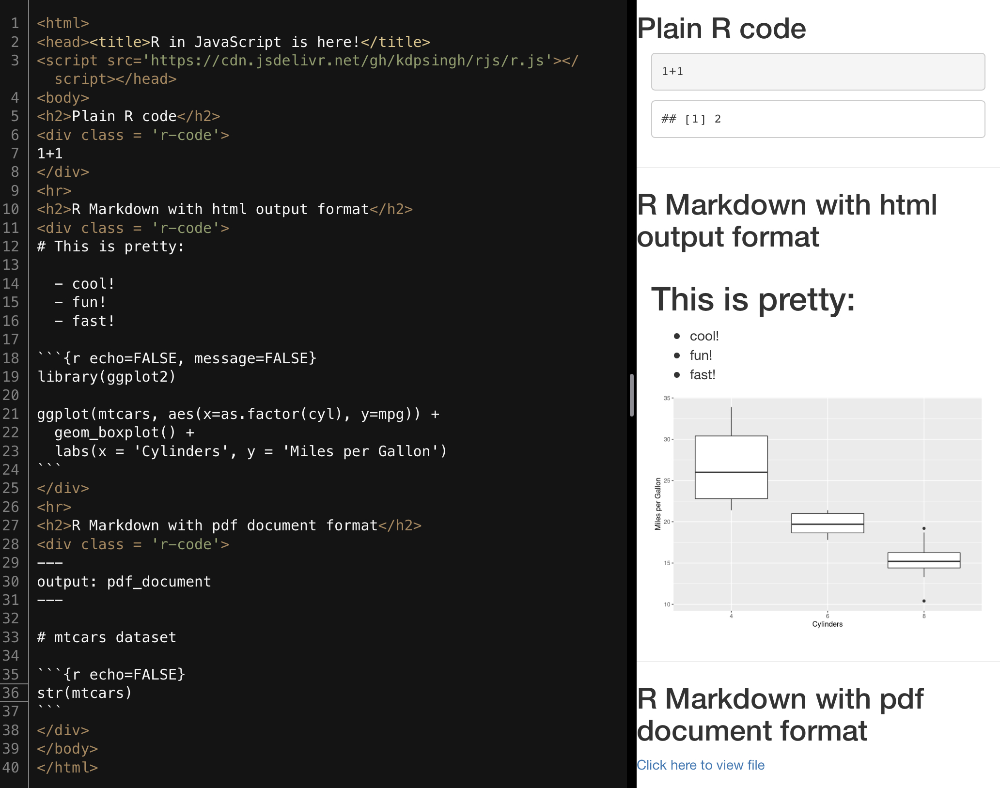

# rjs: R in JavaScript

Introducing R in JavaScript, a way to insert R code directly into websites, powered by [OpenCPU](https://github.com/opencpu/opencpu).

You can use it in 2 easy steps.

## Step 1
Add `` anywhere in your html file (or download `r.js` locally).

## Step 2
Add `class = "r-code"` to any html element containing `R` or `Rmd` code.

That's it.

After `rjs` runs, the `class` will be changed to `"r-code-output"`. You can run R code dynamically in JavaScript by setting the class of any HTML element to `"r-code"` and then calling `rjs();`.

## `rjs` can:
- Auto-detect and process both `R` and `Rmd` formats
- Handle special characters in the input
- Render to non-html formats such as pdf_document (`rjs` automatically provides a link to the file)

## Take a look at the examples in the `examples` folder:

### intro.html

